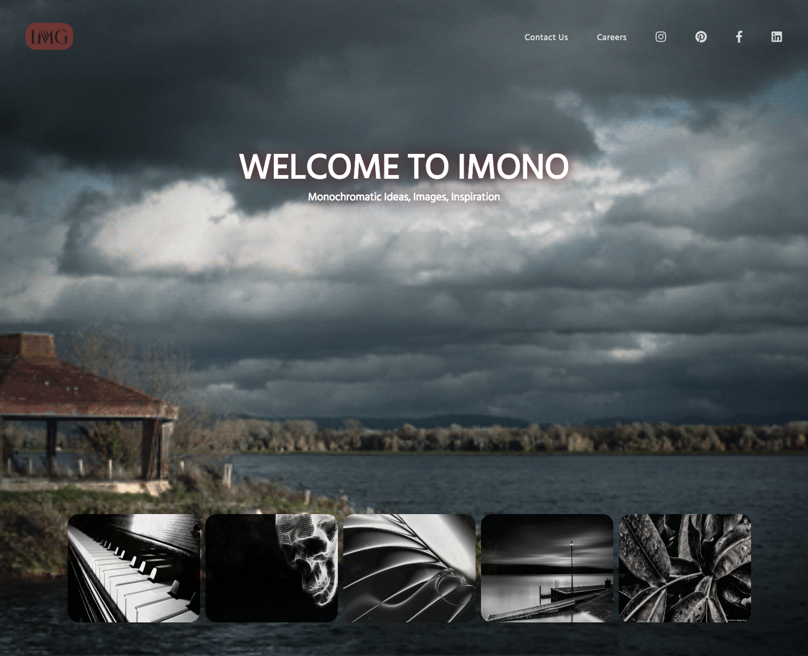
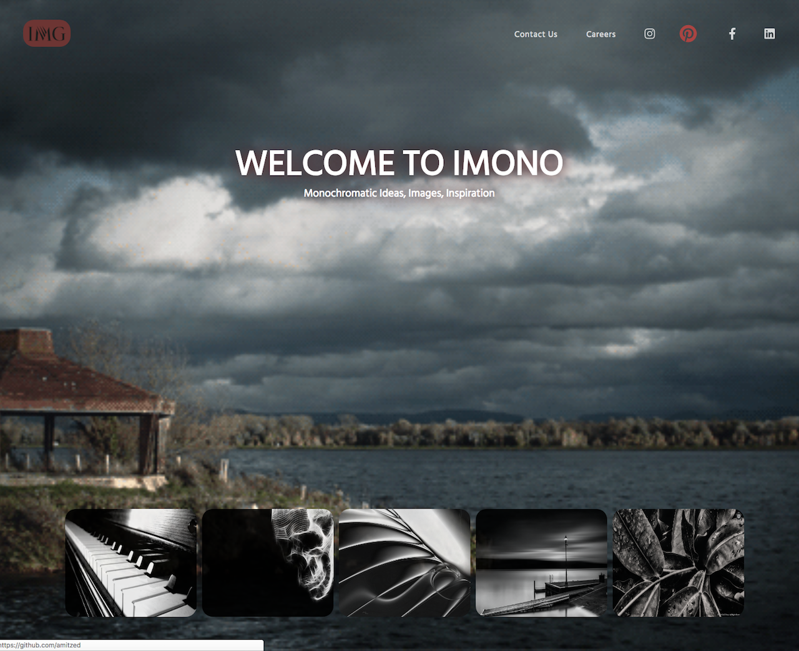

# [IMONO](https://imono.herokuapp.com/index.html)
#### Please Click Landing Page Site Name Above to View Live Heroku Deployment
# [IMONO - HubSpot Version](http://hubspot-developers-w1y9qt-5186824.hs-sites.com/imono)
#### Please Click Landing Page Site Name Above to View the recreated Live HUBSPOT Version Deployment
 

  

  
  
  

Author: [Amit Zaman](https://amitzaman.com)

##### A simple Landing Page site built first to deploy to Heroku and then to recreate and deploy a version of this site on HubSpot.

#### To view the Landing Page's Heroku deployment, click the IMONO name/link above or you can view [here](https://imono.herokuapp.com/index.html).

#### To view the Landing Page's HUBSPOT Version and deployment, click the IMONO - HubSpot Version name/link above or you can view [here](http://hubspot-developers-w1y9qt-5186824.hs-sites.com/imono).

##### [Amit](https://amitzaman.com/)
